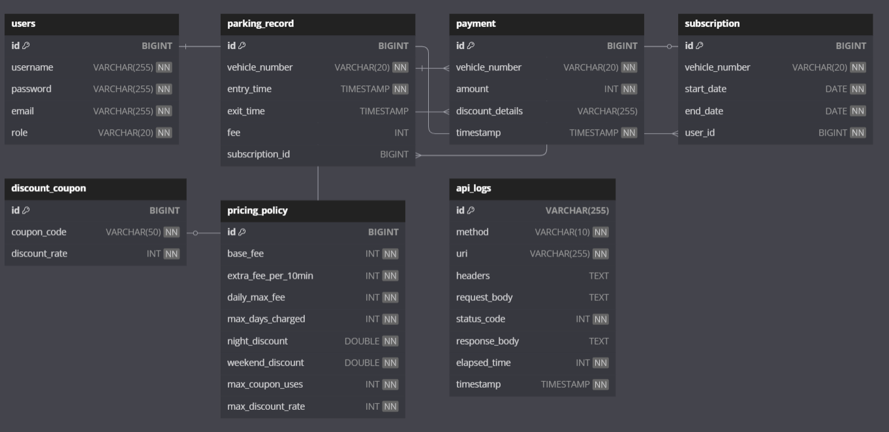
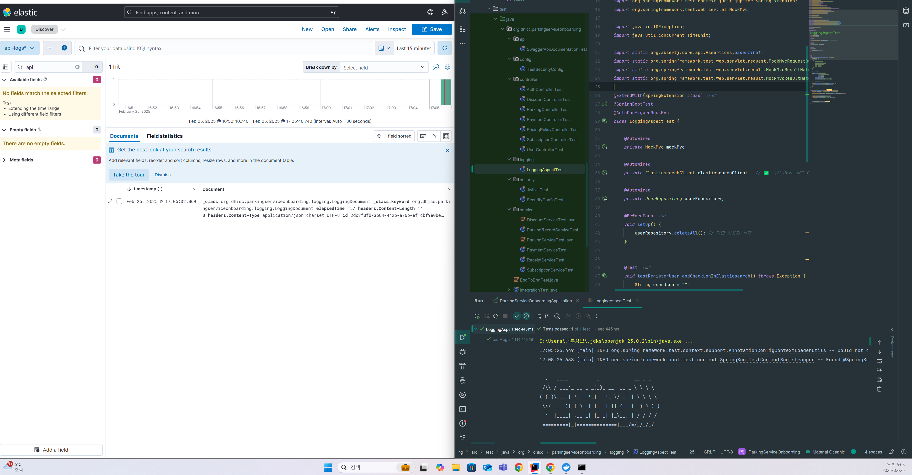

차량 입출차 기록을 기반으로 주차 요금을 계산하고, 결제 및 정기권 관리 기능 등을 제공하는 서비스

# 프로젝트 설정 및 실행 방법

## 1. **필수 환경**

- **Backend:** Java 17, Spring Boot 3.4.2
- **Security:** Spring Security, JWT (JSON Web Token)
- **Database:**PostgreSQL (운영 환경), H2 (테스트 환경 일부)
- **Elasticsearch & Kibana:** API Logging 및 모니터링
- **Async Processing:** Spring Event (비동기 영수증 발송)
- **Testing:** JUnit, Mockito, Testcontainers
- **Maven**

## 2. **프로젝트 실행 방법**

```bash
# 1. 프로젝트 클론
git clone https://github.com/your-repo/parking-service.git
cd parking-service

# 2. application.properties 작성 (로컬 db 연결 )
ex)

spring.application.name=ParkingServiceOnboarding

# PostgreSQL
spring.datasource.url=jdbc:postgresql://localhost:5432/mydb
spring.datasource.username=postgres
spring.datasource.password=????
spring.datasource.driver-class-name=org.postgresql.Driver

# JPA
spring.jpa.hibernate.ddl-auto=update
spring.jpa.show-sql=true
spring.jpa.properties.hibernate.format_sql=true
spring.jpa.database-platform=org.hibernate.dialect.PostgreSQLDialect


springdoc.swagger-ui.path=/swagger-ui.html
springdoc.api-docs.enabled=true
springdoc.swagger-ui.enabled=true
springdoc.swagger-ui.operationsSorter=method

spring.web.resources.add-mappings=false

jwt.secret=xJ3R2n1L8G5U8H3c+PzJb9MmY8ZlU5vPg1MlVpZ3NzU=
jwt.expiration=86400000

spring.elasticsearch.uris=http://localhost:9200
spring.elasticsearch.username=elastic
spring.elasticsearch.password=?????

# 3. Elasticsearch 실행 (Docker 사용)
docker run --name elasticsearch -p 9200:9200 -e "discovery.type=single-node" -d docker.elastic.co/elasticsearch/elasticsearch:8.12.2

# 4. Kibana 실행 (Docker 사용)
docker run --name kibana --link elasticsearch:elasticsearch -p 5601:5601 -d docker.elastic.co/kibana/kibana:8.12.2

# 5. 환경 변수 설정 (.env 또는 application.properties)
# spring.datasource.url=jdbc:postgresql://localhost:5432/mydb
# spring.datasource.username=postgres
# spring.datasource.password=1234

# 6. 프로젝트 실행
mvn spring-boot:run

```

### 3. ERD



## 4. 주요 기능

### ✅  **회원 관리 (User Management)**

- **회원가입 API**: 일반 사용자와 관리자를 등록 가능
- **로그인 API (JWT 인증)**: 로그인 후 JWT 토큰 발급
- **사용자 정보 수정**: 로그인한 사용자는 자신의 정보를 수정 가능
- **사용자 삭제**: 관리자는 특정 사용자를 삭제할 수 있음
- **정기권 차량 제한**: 일반 사용자는 **최대 1개의 정기권 차량만 소유 가능**

### ✅  **주차 관리 (Parking Management)**

- **입차 등록 API**: 차량이 주차장에 들어올 때 등록
- **출차 등록 API**: 차량이 출차할 때 등록 (요금 자동 계산)
- **입출차 기록 조회**: 차량 번호로 주차 이력을 확인 가능

### ✅  **주차 요금 계산 (Parking Fee Calculation)**

- **기본 요금**: 최초 30분은 1,000원
- **추가 요금**: 이후 10분당 500원
- **일일 최대 요금**: 15,000원
- **야간 할인**: 23:00 ~ 07:00 사이 입출차 차량 20% 할인
- **주말 할인**: 토·일요일 10% 할인
- **정기권 차량**: 주차 요금 무료
- **장기 주차 제한**: **최대 3일치 요금까지만 부과**
- **할인 쿠폰 적용 가능**: 10% ~ 50% 할인 쿠폰 적용 가능

### ✅  **결제 시스템 (Payment System)**

- **출차 시 요금 결제 API**: 차량 번호로 결제 가능
- **결제 내역 조회 API**: 사용자별 결제 기록 조회
- **관리자 전체 결제 내역 조회 API**
- **비동기 영수증 발송**: 결제 완료 시 **이메일 발송 (Mock API 연동)**

### ✅  **정기권 관리 (Subscription Management)**

- **정기권 등록 API**: 사용자는 정기권을 등록 가능
- **정기권 차량 무료 처리**: 정기권이 적용된 차량은 요금 부과 없음
- **정기권 만료 자동 삭제**: 만료된 정기권을 자동으로 삭제하는 **스케줄러 적용**

### ✅  **할인 쿠폰 시스템 (Discount System)**

- **할인 쿠폰 생성 API (관리자)**
- **할인 쿠폰 적용 API**
- **할인 쿠폰 조회 API**

### ✅  **API 요청 로깅 및 모니터링 (AOP 기반 Logging + ELK Stack)**

- **Spring AOP를 활용한 API 요청/응답 로깅**
- **Elasticsearch에 API 요청/응답 저장**
- **Kibana 대시보드 연동 (API 호출 분석 가능)**

### ✅  **보안 및 인증 (Security & Authentication)**

- **JWT 기반 인증**: 로그인 시 JWT 토큰 발급 및 검증
- **Spring Security 적용**: 권한(Role)에 따라 접근 제한
- **BCrypt를 사용한 패스워드 암호화**

### ✅  **스케줄링 (Scheduled Tasks)**

- **매일 정기권 만료 확인 및 자동 삭제**
- **7일 이상 지난 주차 기록 자동 삭제**

## 5. API 문서

Application 실행 후 Swagger URL 로 확인 가능

**Swagger URL:** `http://localhost:8080/swagger-ui.html`

### **회원 관련 API (`/auth`, `/users`)**

| API | HTTP Method | 요청 경로 | 요청 데이터 | 응답 데이터 | 권한 |
| --- | --- | --- | --- | --- | --- |
| 회원가입 | `POST` | `/auth/register` | `UserRequest (username, password, email, role)` | `"회원가입이 완료되었습니다."` | 누구나 |
| 로그인 (JWT 발급) | `POST` | `/auth/login` | `username, password` | `{ "token": "JWT토큰" }` | 누구나 |
| 현재 로그인한 사용자 조회 | `GET` | `/users/me` | `JWT 필요` | `UserResponse (username, email, role)` | 사용자, 관리자 |
| 특정 사용자 조회 | `GET` | `/users/{id}` | `JWT 필요` | `UserResponse (username, email, role)` | 관리자 |
| 회원 정보 수정 | `PATCH` | `/users/me` | `UserUpdateRequest (username, email)` | `UserResponse` | 사용자 |
| 회원 삭제 | `DELETE` | `/users/{id}` | `JWT 필요` | `204 No Content` | 관리자 |

---

### **주차 관련 API (`/parking`)**

| API | HTTP Method | 요청 경로 | 요청 데이터 | 응답 데이터 | 권한 |
| --- | --- | --- | --- | --- | --- |
| 입차 기록 등록 | `POST` | `/parking/entry/{vehicleNumber}` | `차량번호` | `ParkingRecord` | 사용자 |
| 출차 기록 등록 | `POST` | `/parking/exit/{vehicleNumber}` | `차량번호` | `ParkingRecord (요금 포함)` | 사용자 |
| 주차 기록 조회 | `GET` | `/parking/{vehicleNumber}` | `차량번호` | `List<ParkingRecordDTO>` | 사용자, 관리자 |

---

### **결제 관련 API (`/payment`)**

| API | HTTP Method | 요청 경로 | 요청 데이터 | 응답 데이터 | 권한 |
| --- | --- | --- | --- | --- | --- |
| 결제 처리 | `POST` | `/payment/process/{vehicleNumber}` | `차량번호, (옵션) 할인쿠폰` | `Payment (결제 금액, 할인 정보 포함)` | 사용자 |
| 특정 결제 내역 조회 | `GET` | `/payment/{id}` | `결제 ID` | `Payment` | 사용자 |
| 전체 결제 내역 조회 | `GET` | `/payment/all` | 없음 | `List<Payment>` | 관리자 |

---

### **정기권 관련 API (`/subscription`)**

| API | HTTP Method | 요청 경로 | 요청 데이터 | 응답 데이터 | 권한 |
| --- | --- | --- | --- | --- | --- |
| 내 정기권 조회 | `GET` | `/subscription/me` | `JWT 필요` | `SubscriptionDTO` | 사용자 |
| 정기권 등록 | `POST` | `/subscription/register` | `SubscriptionDTO (차량번호, 시작일, 종료일)` | `SubscriptionDTO` | 사용자 |
| 정기권 취소 | `DELETE` | `/subscription/admin/{vehicleNumber}` | `차량번호` | `"정기권이 취소되었습니다."` | 관리자 |

---

### **요금 정책 관련 API (`/pricing-policy`)**

| API | HTTP Method | 요청 경로 | 요청 데이터 | 응답 데이터 | 권한 |
| --- | --- | --- | --- | --- | --- |
| 현재 요금 정책 조회 | `GET` | `/pricing-policy` | 없음 | `PricingPolicy` | 누구나 |
| 요금 정책 변경 | `PUT` | `/pricing-policy` | `새로운 PricingPolicy` | `"요금 정책 변경됨"` | 관리자 |

---

### **할인 쿠폰 관련 API (`/discount`)**

| API | HTTP Method | 요청 경로 | 요청 데이터 | 응답 데이터 | 권한 |
| --- | --- | --- | --- | --- | --- |
| 할인 적용 | `POST` | `/discount/apply/{couponCode}/{fee}` | `쿠폰코드, 원래 요금` | `{ "discountedFee": 최종요금 }` | 사용자 |
| 할인 쿠폰 생성 | `POST` | `/discount/create` | `DiscountCoupon` | `DiscountCoupon` | 관리자 |
| 할인 쿠폰 목록 조회 | `GET` | `/discount/all` | 없음 | `List<DiscountCoupon>` | 관리자 |

---

## 6. **Kibana에서 API 로그 확인 방법**

사전작업 : Docker Compose 파일 생성 → Logstash 설정 (Elasticsearch로 로그 전송) → Docker 컨테이너 실행

1. `http://localhost:5601` 접속 후 Kibana 실행
2. **"Stack Management" → "Index Patterns"** 로 이동
3. `api-logs*` 패턴을 생성하고, `timestamp` 필드를 **Time Filter**로 설정
4. **Discover 탭**에서 API 요청 및 응답 로그 확인 가능


단위test 실행 후 kibana에 기록된 api log

## **7. 프로젝트 특징**

- **AOP 기반 API 요청 로깅**으로 **모든 API 요청 및 응답을 기록**
- **Kibana 대시보드**를 통해 API 호출 통계를 한눈에 확인 가능
- **요금 정책을 동적으로 변경할 수 있는 API 지원**
- **JWT 인증과 역할(Role) 기반 접근 제어**로 보안 강화
- **비동기 이벤트 기반 영수증 발송 시스템 구현**
- **스케줄링 기능을 통해 정기권 및 주차 기록 자동 관리**